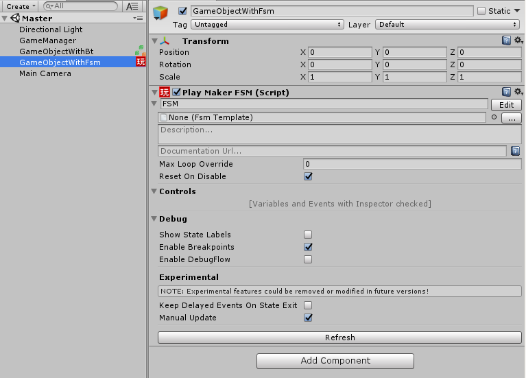

# masterSchedulerScripts
A few scripts to allow MasterScheduler to control Playmaker and Behavior Designer update ticks

**REQUIREMENTS**
//MasterScheduler https://assetstore.unity.com/packages/tools/ai/master-scheduler-100283

//Behavior Designer (If you want to update that)

//Playmaker (If you want to update that)

**Notes on useage:

QueueManager - use this to create your master scheduler queues- this runs on Awake- this needs to run BEFORE any of the other scripts

SetManualTickUpdateOnStart - use this to make it so behavior designer will manually update all BT's using the Queue you choose

ManuallyUpdateFsm - use these to manually update the FSM's you add to "FsmsToUpdate" using the Queue you choose (Can use the below action if you want to add an FSM from Playmaker itself)

AddFsmToMasterSchedulerUpdate - Playmaker action to add the Fsm this is used in to a Queue(can use this instead of "ManuallUpdateFsm")

**Setup images**
**(If using the PM action you don't need the "ManuallkyUpdateFsm" script)**

